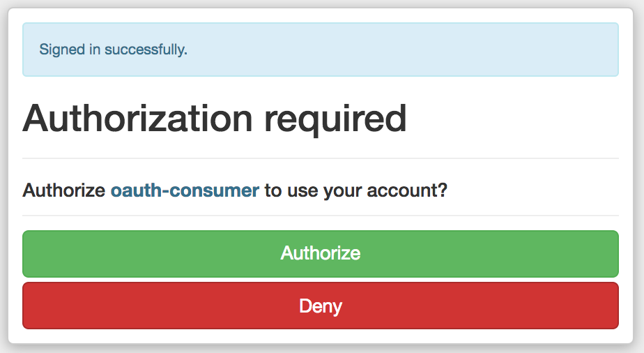
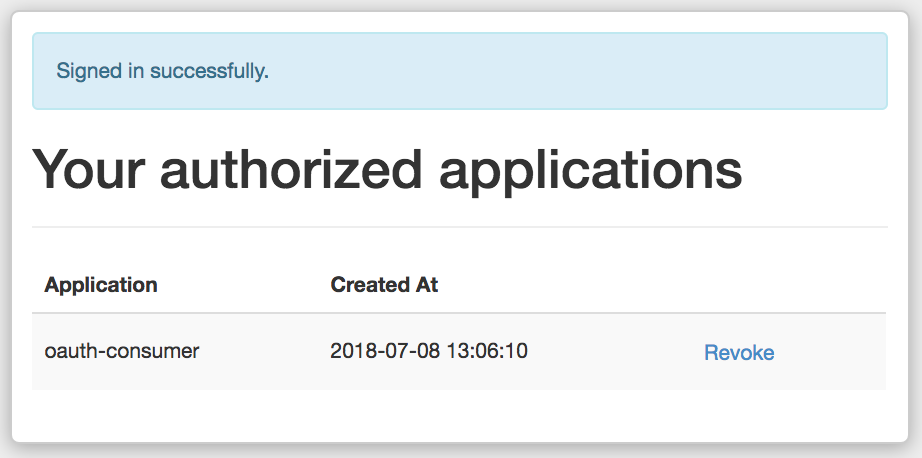

# README

* Ruby version
2.5.1

* oauth2 version
1.4.0

* omniauth version
1.8.1

* omniauth-oauth2 version
1.5.0

* jwt version
1.5.6

## About
This is a dummy OAuth application (Consumer).

In short this OAuth2 application (Provider and Consumer) displays the relationship between a User Service (the Provider application) that Authenticates the User and allows them to Authorize applications.

Devise is used to Authenticate users and Doorkeeper is used to Authorize applications.


## Getting up and running

This application is the OAuth Consumer/Client application (on port 3001) and should be run alongside the Provider/Server application (on port 3000).

The reason they are to be run on specific ports is due to the omniauth configuration on the Consumer application in doorkeeper.rb:

```ruby
option :client_options, {
  site:          'http://localhost:3000',
  authorize_url: 'http://localhost:3000/oauth/authorize'
}
```

## OAuth Provider

The Provider application authenticates the user using the devise gem. It also carries out the authorization of Consumer applications by providing the user with an authorization_code that is then exchanged for an access_token (a JWT).

Once running, Consumer applications can be added on the http://localhost:3000/oauth/applications page.

`git clone git@github.com:PMGH/oauth2-test-provider.git`

- cd into repo and run: `PORT=3000 rails server`


## OAuth Consumer

The OAuth Consumer application is the application which the user is seeking access to.

`git clone git@github.com:PMGH/oauth2-test-consumer.git`

- cd into repo and run: `PORT=3001 rails server`

**Security:**
- The Consumer app contains an omniauth strategy (named 'doorkeeper') that redirects the user to the Provider application.
- The Omniauth strategy must be configured to use the Provider application Client_ID and Client_Secret.
- Verifies the access_token cookie on each request (HTML).
- Verifies the Authorization bearer_token on each request (JSON API).
- If the user doesn't have a valid access_token or bearer_token they are redirected to the Provider app sign_in page.


## Workflow (HTML)
- When trying to access the Consumer app (http://localhost:3001) for the first time the user should be redirected to the sign in page of the Provider app (http://localhost:3000/users/sign_in)
- Once signed in they should be presented with the Authorization request (at http://localhost:3000/oauth/authorize) with Authorize and Deny buttons. The url should contain the following query params:

```
client_id - the Consumer app id found on the http://localhost:3000/oauth/applications/:id page
redirect_uri - the Consumer app callback uri found on the http://localhost:3000/oauth/applications/:id page e.g. http://localhost:3001/auth/doorkeeper/callback
response_code=code  - expects an authorization code to be returned
```

For example:

`http://localhost:3000/oauth/authorize?client_id=YOUR_CLIENT_ID&redirect_uri=urn:ietf:wg:oauth:2.0:oob&response_type=code`



- Once authorized the user will be provided with an authentication code that the Provider app exchanges for an access_token.
- User is redirected to the Consumer app that they initially tried to access.
- The Consumer app adds an access_token cookie that allows the user access for as long as the token is valid.
- Token expiry is determined by the Provider app (the issuer) in the doorkeeper.rb file.
- The user should be able to access the Consumer app.

- The user can check which applications they have authorized by visiting: http://localhost:3000/oauth/authorized_applications




## API Journey (JSON)

**Get an access_token** (using Postman)
- Create a new POST request
- Navigate to the Authorization tab
- Set 'Add authorization data to' to Request Headers
- Select the Get Access Token button
- Set the necessary Headers e.g.

```
Token Name:             Consumer Access Token
Grant Type:             Authorization code
Callback URL:           http://localhost:3001/auth/doorkeeper/callback
Auth URL:               http://localhost:3000/oauth/authorize
Access Token URL:       http://localhost:3000/oauth/token
Client ID:              7284d5786ad5f08a523916b992175210dc4dd1b6995e0028d5d856a31f077523
Client Secret:          dafa4a696ff4c4b6ddb9a0b6253414e2c05ee2b221e8fb6cbd5ba635abed5e45
Scope:                  
State:                  
Client Authentication:  Send client credentials in body
```

- Request Token

> You can now include the returned access_token in subsequent requests to the Consumer application.

> This can be done by setting the Authorization Type to Bearer Token for those requests and using `Bearer [access_token]`.


## Key steps

**Key Gems**
- ruby '2.5.1'
- gem 'omniauth-oauth2'
- gem 'jwt'

**Routes**
- redirect to the /auth/doorkeeper (omniauth strategy)
- get '/auth/doorkeeper/callback' => 'application#authentication_callback'
- can constrain the root path if no access_token cookie is present (and redirect to /auth/doorkeeper) - there may be a better way of handling this...
Note: constraint is needed at the moment as the verify_access_token method is used on controllers only not at root

```ruby
Rails.application.routes.draw do
  # redirect root ('localhost:3001/') to '/auth/doorkeeper' - omniauth strategy if no access_token cookie
  root to: redirect('/auth/doorkeeper'), constraints: lambda { |request| !request.cookies['access_token'] }

  # get '/auth/:provider/callback' => 'application#authentication_callback'
  get '/auth/doorkeeper/callback' => 'application#authentication_callback'
end
```

**Omniauth Strategy**
- define the Provider application in the omniauth.rb file in the /config/initializers directory

```ruby
require 'doorkeeper'

Rails.application.config.middleware.use OmniAuth::Builder do
  # provider :doorkeeper, <application_id>, <application_secret>
  provider :doorkeeper, '7284d5786ad5f08a523916b992175210dc4dd1b6995e0028d5d856a31f077523', 'dafa4a696ff4c4b6ddb9a0b6253414e2c05ee2b221e8fb6cbd5ba635abed5e45'
end
```

**Setup the Application controller**
- add an authentication_callback method, this is the method that will be called when the user is redirected after they authorize the Consumer application. (This could be changed to redirect the user to the home page after setting the user).
- add a set_user method to find_or_create the user based on the contents of the auth object. This will build up a Consumer Users database over time. GDPR should be considered. For example, if a User is updated/deleted from the User Service (Provider) a cascading service may be needed.

```ruby
class ApplicationController < ActionController::Base
  def authentication_callback
    auth = request.env['omniauth.auth']
    if auth
      set_user(auth)
      render json: auth
    else
      redirect_to "http://localhost:3000/users/sign_in"
    end
  end

  private

  def set_user auth
    user = {
      id: auth['uid'],
      name: auth['extra']['raw_info']['name'],
      email: auth['extra']['raw_info']['email']
    }
    User.find_or_create_by(user)
    cookies[:access_token] = auth['credentials']['token']
  end
end
```

**Verify Access Token**
- add the verify access_token function in /lib directory so that it can be required into the necessary controllers.

```ruby
def verify_access_token
  token = cookies[:access_token]
  jwt = JWT.decode token, ENV['SECRET'], true, { algorithm: ENV['ALGORITHM'] } if token
  redirect_to "http://localhost:3001/auth/doorkeeper" if !jwt
end
```

**Setup a controller**
- inherit from the ApplicationController.
- require the verify_access_token method from the /lib directory.
- add a before_action for :verify_access_token so that the access_token is verified prior to a controller action taking place. i.e. checks the user is allowed to perform an action.
- scopes could be added to the access_token (permissions) **TBC**

```ruby
require 'verify_access_token'

class UsersController < ApplicationController
  before_action :verify_access_token
  before_action :set_user, only: [:show, :edit, :update, :destroy]

  # GET /users
  # GET /users.json
  def index
    @users = User.all
  end

  .
  .
  .
```

**Environment Variables**
- environment variables such as JWT secret and hashing algorithm can be stored in the local_env.yml e.g.

```ruby
SECRET: "SOME-SECRET"
ALGORITHM: "ENIGMA-CODE"
```

- load local_env.yml into application (/config/application.rb):

```ruby
module OauthClient
  class Application < Rails::Application
    # load local_env.yml file
    config.before_configuration do
      env_file = File.join(Rails.root, 'config', 'local_env.yml')
      YAML.load(File.open(env_file)).each do |key, value|
        ENV[key.to_s] = value
      end if File.exists?(env_file)
    end
  end
end
```

- local_env values can be accessed using ENV['key_name'] e.g. ENV['SECRET']
- note that this is how the verify_access_token method gets it's Secret and Algorithm values. These should be agreed between the Provider and Consumer applications.

**Sign Out**
- sign out is handled by a GET request (configurable (GET/DELETE) in the Provider doorkeeper.rb) to :provider/users/sign_out e.g. http://localhost:3000/users/sign_out
- sign out performs a delete session but overrides the destroy method of the Devise::SessionsController to additionally clear the access_token cookie.


## Resources
**OAuth 2**
- OAuth2 Overview:  https://www.youtube.com/watch?v=CPbvxxslDTU
- Difference between OAuth1 and OAuth2:  https://stackoverflow.com/questions/4113934/how-is-oauth-2-different-from-oauth-1
- Introduction to OAuth2:  https://hueniverse.com/introducing-oauth-2-0-b5681da60ce2
- OAuth2 Simplified:  https://aaronparecki.com/oauth-2-simplified/

**Devise**
- Devise:  https://github.com/plataformatec/devise
- Cheat Sheet:  https://devhints.io/devise

**Doorkeeper**
- Doorkeeper:  https://github.com/doorkeeper-gem/doorkeeper
- Doorkeeper Authorization Flow:  https://github.com/doorkeeper-gem/doorkeeper/wiki/Authorization-Code-Flow

**JWTs**
- Doorkeeper-JWT:  https://github.com/chriswarren/doorkeeper-jwt
- JWTs:  https://jwt.io/
- Understanding JWTs:  https://medium.com/vandium-software/5-easy-steps-to-understanding-json-web-tokens-jwt-1164c0adfcec

**Sessions and Cookies**
- Sessions and Cookies in Rails:  https://www.theodinproject.com/courses/ruby-on-rails/lessons/sessions-cookies-and-authentication

**CSRF**
- API:  https://stackoverflow.com/questions/9362910/rails-warning-cant-verify-csrf-token-authenticity-for-json-devise-requests

**Security in Rails**
- Security:  http://guides.rubyonrails.org/security.html

**Code-along Tutorials**
- OAuth2 on Rails (the Provider application):  https://dev.mikamai.com/2015/02/11/oauth2-on-rails/
- OAuth2 on Rails (the Consumer application):  https://dev.mikamai.com/2015/03/02/oauth2-on-rails-the-client-application/
